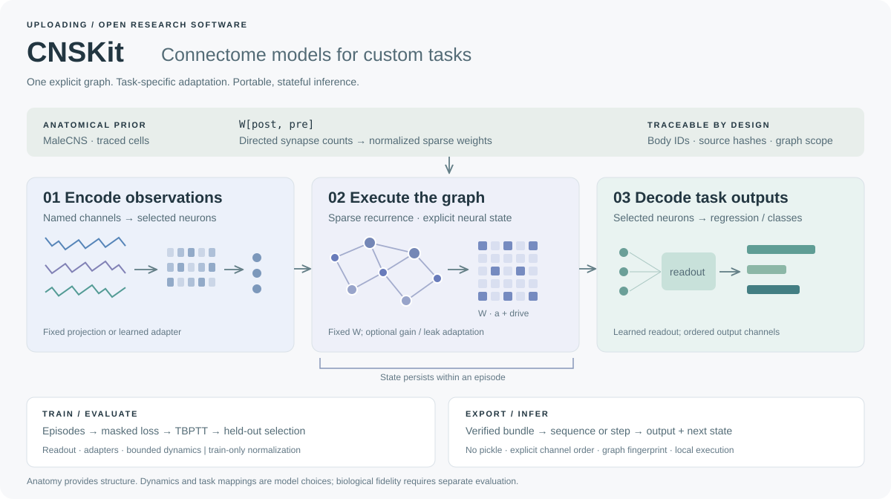

# CNSKit

[](LICENSE)
[](pyproject.toml)

**Train task-specific models on a connectome. Run them in your own application.**

CNSKit connects MaleCNS graph data to a practical Python workflow: bind observations to selected neurons, train a readout or input adapter, evaluate held-out episodes, and export a stateful inference model. The graph stays sparse and its body IDs and source provenance travel with the model.

[Quickstart](#quickstart) 路 [Training guide](docs/TRAINING.md) 路 [MaleCNS data](docs/MALECNS.md) 路 [API](docs/LEARNING_API.md) 路 [Evidence](docs/VALIDATION.md)



## What you can do

| Workflow | Implementation |
|---|---|
| Custom sequence regression or classification | Episode datasets, target masks, Adam, gradient clipping, truncated backpropagation |
| Fixed-graph experimentation | Train only a readout, input/output adapters, or adapters plus bounded per-neuron gains and leak |
| MaleCNS integration | Verified graph import, exact body-ID binding, explicit induced subgraphs |
| Stateful inference | Batched sequences or one step at a time; state is passed explicitly |
| Reproducible export | NumPy checkpoints without pickle, graph fingerprint, ordered channels, fitted normalization and training report |
| Lightweight baseline | NumPy ridge readout fitting remains available without PyTorch |

The framework is task-general; it is not a pretrained general intelligence model. Anatomical connectivity is an experimental prior. Dynamics, observation encodings and learned outputs are model choices. We do not claim biological fidelity, a MaleCNS advantage over ordinary networks, or whole-connectome training speedups.

## Quickstart

Python 3.11 or newer. No account, server or connectome download is needed for the synthetic example.

```sh
git clone https://github.com/OpenUploading/cnskit.git
cd cnskit
python -m venv .venv
# Linux/macOS: source .venv/bin/activate
# Windows: .venv\Scripts\Activate.ps1
python -m pip install -e ".[train,malecns]"
python examples/train_sequence.py --out runs/first-policy
```

This fits a temporal filtering task on a **synthetic graph**, evaluates separate test episodes, compares against observation-only ridge regression, and verifies checkpoint reload. It demonstrates the workflow, not MaleCNS performance. PyTorch is optional; install the appropriate CPU/CUDA wheel for your environment before the package if needed.

For masked sequence classification, run `python examples/train_classification.py --out runs/classifier`. For matched recurrent and zero-edge baselines, run `python examples/compare_baselines.py`.

```python
from cnskit import load_policy
import numpy as np

policy = load_policy("runs/first-policy")
prediction, state = policy.predict(np.zeros((1, 16, 2), dtype="float32"))
# Continue the SAME episode by passing state; omit it to start a new episode.
prediction, state = policy.predict(np.ones((1, 8, 2), dtype="float32"), state=state)
```

## Use the anatomical graph

Prepare the official files following the [dataset guide](docs/MALECNS.md). Then bind task dimensions and actual neuron IDs explicitly:

```python
from cnskit import Graph, ConnectomeModel, Trainer

graph = Graph.from_malecns("/data/traced-graph")
model = ConnectomeModel(
    graph, input_ids=[12032], readout_ids=[10001, 10010],
    input_size=4, output_size=2, mode="adapters", seed=7,
    input_names=["cue_left", "cue_right", "speed", "context"],
    output_names=["turn", "advance"],
)
# train_episodes and validation_episodes contain YOUR aligned inputs and targets.
report = Trainer(model, objective="regression", tbptt=32).fit(
    train_episodes, validation_episodes, epochs=30,
)
model.save("runs/my-policy", report=report)
```

These IDs illustrate API binding, not an established mapping from arbitrary four-dimensional observations to fly behavior. For development, begin with an explicit subgraph and short sequences. The full traced graph has tens of millions of edges; full-graph differentiation has material memory and compute costs. CPU validation is recorded in [the evidence report](docs/VALIDATION.md); CUDA execution is supported by tensor placement but has not been benchmarked here.

## Compatibility and scope

`cnskit` is the training API and CLI. The distribution name `cns-tinker` and existing `cns_tinker` imports remain for compatibility. This is a source release, not a claim of a published PyPI package. Legacy scenario APIs and synthetic game recipes remain available; their configuration-only cloud job interfaces are separate from the new local trainer.

Apache-2.0. Data is downloaded separately under upstream terms. See [licensing](docs/LICENSING.md).

## Contribute

Bring a task, a reproducible baseline, or an execution improvement. See [contributing](CONTRIBUTING.md), [validation](docs/VALIDATION.md) and the [roadmap](docs/ROADMAP.md). The most useful next result is a well-controlled task study that establishes when anatomical structure helps.
